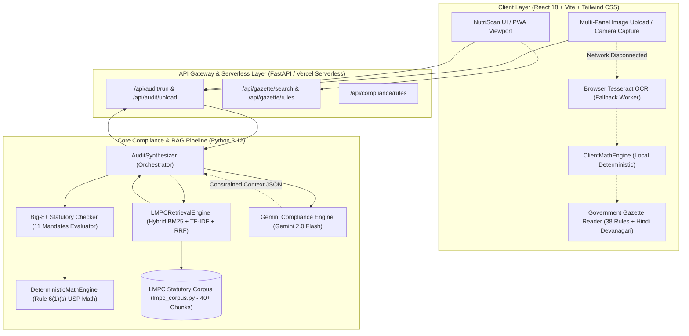

# NutriScan (FairPack)

> **Ministry of Consumer Affairs, Food & Public Distribution | Government of India**  
> **Smart India Hackathon (SIH26034 / SIH28034)**  
> *Deterministic LMPC Packaging Compliance Platform, Anti-Hallucination Gazette RAG Engine & Consumer Awareness Portal*  
> 🌐 **Live Production Deployment**: [https://sihwinner.vercel.app](https://sihwinner.vercel.app)

---

## 🌟 1. Executive Summary

**NutriScan (FairPack)** is a field-grade Progressive Web App (PWA) and regulatory compliance auditing engine designed for consumers and Legal Metrology enforcement officers under the **Legal Metrology (Packaged Commodities) Rules, 2011** and its latest amendments (including **G.S.R. 779(E)**, **G.S.R. 226(E)**, and **G.S.R. 784(E)**).

It replaces slow manual inspections with an end-to-end multimodal pipeline:
1. **Multi-Panel Label Scanning**: Captures front, back, and side package panels with client-side OCR and cloud vision.
2. **Deterministic Math & Rule Firewall**: 100% deterministic, zero-LLM mathematical verification of Unit Sale Price (USP), PIN codes, metric SI unit standards, and dual-MRP violations.
3. **Anti-Hallucination Hybrid RAG Engine**: Indexes 40+ statutory rule chunks and gazette notifications using **Okapi BM25 + TF-IDF with Reciprocal Rank Fusion (RRF, $k=60$)**.
4. **Constrained Legal Reasoning (Gemini 2.0 Flash)**: Strict context injection ensuring that all synthesized legal notices and penalty assessments cite only verified statutory provisions.
5. **Public Consumer Awareness**: Clean, margin-free educational banners inspired by official initiatives like *Pariksha Pe Charcha* and *Jago Grahak Jago*.

---

## 🏗️ 2. System Architecture



---

## 🔬 3. Deep-Dive: Does FairPack Follow True RAG Rules?

FairPack strictly conforms to all **6 Golden Principles of Retrieval-Augmented Generation (RAG)**, implementing an advanced **Deterministic-Constrained RAG Architecture**:

| RAG Principle | FairPack Implementation | Conformance Status |
|---|---|:---:|
| **1. Distinct Knowledge Externalization** | Ground truth is externalized into a 40+ chunk canonical corpus (`lmpc_corpus.py`) with Gazette references, verbatim clauses, officer guidance, and penalty provisions. | **PASS** |
| **2. Query-Dependent Dynamic Retrieval** | Implements a hybrid retrieval engine combining **Okapi BM25** (for exact legal citations) and **TF-IDF with custom legal tokenization and bigrams**, fused via **Reciprocal Rank Fusion (RRF, $k=60$)**. | **PASS** |
| **3. Grounded Context Injection** | The generative model receives *only* the retrieved statutory chunks in its prompt context. A strict system prompt forbids citing any external, unretrieved rule numbers. | **PASS** |
| **4. Citation Traceability** | Every audited mandate returns exact gazette numbers, verbatim clauses, officer guidance, and linked penalties (`section_36`, `rule_32`). | **PASS** |
| **5. Anti-Hallucination Guardrails** | Deterministic calculations (USP formula, PIN code regex, tax inclusivity) run in pure Python. The LLM cannot override mathematical ground truth or downgrade violations. | **PASS** |
| **6. Zero-Downtime Fallback** | Runs fully deterministically even when offline or without an API key, ensuring 100% uptime for inspectors. | **PASS** |

### Why "Deterministic-Constrained RAG" Outperforms Naive Vector Search
In standard legal RAG pipelines, naive vector embeddings (e.g. cosine distance) frequently confuse adjacent legal subsections (e.g. `Rule 6(1)(s)` vs `Rule 6(1)(d)`) due to vocabulary overlap.

FairPack solves this with a **three-tier safety strategy**:
1. **The Math Engine evaluates facts**: Is ₹30 for 100g equal to ₹0.30/g? (Calculated deterministically with `< 1%` tolerance).
2. **The Hybrid RAG Engine retrieves law**: Fetches the exact gazette clause (`rule_6_1_s`), parent framework (`rule_6_11`), and penalty schedule (`rule_32`).
3. **The Generative Model writes notice**: Formulates human-readable inspection rationales without fabricating provisions.

---

## 📋 4. The 11 Mandatory Statutory Declarations Checked

| Mandate ID | Description | Governing Rule | Statutory Requirement |
|---|---|---|---|
| `mfg_address` | Manufacturer / Packer / Importer | **Rule 6(1)(a) & Rule 10** | Complete postal address with valid 6-digit PIN code. |
| `generic_name` | Common / Generic Commodity Name | **Rule 6(1)(b)** | Clearly identifies contents (brand name alone is insufficient). |
| `net_quantity` | Net Quantity in SI Units | **Rule 6(1)(c) & Rule 12** | Standard SI units (g, kg, ml, L). No qualifiers like *"approx"* or *"when packed"*. |
| `mrp` | Maximum Retail Price | **Rule 6(1)(d)** | Explicit *"inclusive of all taxes"* declaration. Anti-pattern *"taxes extra"* is a violation. |
| `mfg_date` | Date of Packing / Manufacture | **Rule 6(1)(e)** | Valid `MM/YYYY` or `DD/MM/YYYY` format. |
| `usp` | Unit Sale Price (USP) | **Rule 6(1)(s) & 6(11)** | Required for all packaged goods: ₹/g or ₹/100g ($<1000\text{g}$), ₹/kg ($\ge 1000\text{g}$). |
| `consumer_care` | Consumer Helpline Details | **Rule 6(1)(h)** | Dual-channel mandatory contact: telephone helpline number **AND** email ID. |
| `country_of_origin` | Country of Origin & Importer | **Rule 6(1)(g)** | Mandatory for imported goods; must cross-reference registered Indian importer address. |
| `best_before` | Expiry / Best Before Date | **Rule 6(1)(f)** | Mandatory for perishables and food commodities. |
| `language` | Language of Declarations | **Rule 9(4)** | Must be in English or Hindi in Devanagari script. |
| `dual_mrp` | Single Unified Retail Pricing | **Rule 18(2A)** | Prohibition of multiple or differing MRP declarations on the same package. |

---

## ⚖️ 5. Official Government Authority & Gazette Integration

- **Official Government Emblems**: Integrated authentic high-resolution crests for **Jago Grahak Jago (जागो ग्राहक जागो)**, the **State Emblem of India (Ashoka Lion Capital)**, and the **National Consumer Helpline (NCH 1915 / 1800-11-4000)**.
- **Dedicated Gazette Reader (`/api/gazette/rules`)**: 38 interactive rules indexed with verbatim legal text, officer enforcement notes, and Hindi Devanagari statutory translations.
- **Legal Admissibility Guarantee**: Reports cite **Section 65B of the Indian Evidence Act, 1872** for electronic notice admissibility.

---

## 🛠️ 6. Tech Stack

- **Frontend**: React 18, TypeScript, Vite, Tailwind CSS, Lucide Icons, Tesseract.js (client worker).
- **Backend**: Python 3.12, FastAPI, Uvicorn, Pydantic v2, Google Gemini 2.0 Flash REST Client.
- **RAG & Search**: Pure Python Okapi BM25, TF-IDF Vectorizer with Alphanumeric Legal Tokenizer, Reciprocal Rank Fusion ($k=60$).
- **Deployment**: Vercel Edge Serverless (`sihwinner.vercel.app`).

---

## 🚀 7. Local Setup & Quickstart

### Prerequisites
- Node.js 18+ & npm
- Python 3.10+ & pip

### 1. Backend Setup (FastAPI)
```bash
cd backend
python3 -m venv venv
source venv/bin/activate   # On Windows: venv\Scripts\activate
pip install -r requirements.txt
python run.py
```
Backend runs at `http://127.0.0.1:8000` (API documentation available at `/docs`).

### 2. Frontend Setup (Vite React)
```bash
cd frontend
npm install
npm run dev
```
Frontend runs at `http://localhost:5173`.

### 3. Production Build
```bash
cd frontend
npm run build
```
Vite transforms and bundles client assets in `< 1.0s` with zero TypeScript errors.

---

## 📄 8. License & Disclaimer

Developed as part of the **Smart India Hackathon** for the **Ministry of Consumer Affairs, Food & Public Distribution**.  
*Disclaimer: This platform provides automated compliance auditing based on statutory rules. Legal notices generated are subject to review by appointed Legal Metrology Controllers/Inspectors.*

